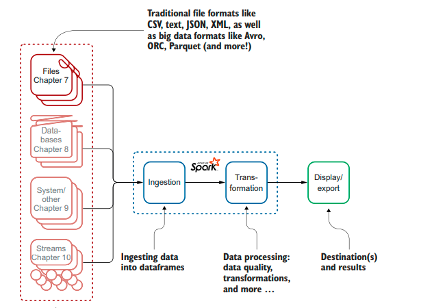

% Spark in Action: Second Edition
% Chapter 07
% Ingestion

# Ingestion - Chapter 07

## Text Book

## Objectives

- Common behaviors of parsers
- Ingesting from CSV, JSON, XML, and text files
- Understanding the difference between one-line and multiline JSON records
- Understanding the need for big data-specific file formats

## Review 1 of 2

- What are the 4 steps involved in Data Engineering?
- What step is the Data Scientist generally focused on?
- What is a DataFrame?
- What 5 languages does Spark support out of the box?
- What is the Spark Driver?
- What is the SparkSession?
- What are Partitions in Spark?
- What does it mean that Spark dataframes are immutable?
- What is the difference between a dataset and dataframe?

## Review 2 of 2

- Which supported languages can use datasets in Spark?
- Name 2 differences between using a CSV and a JSON file in Spark?
- Spark is efficiently lazy: it will build the list of transformations as a what?
- Is the data is not modified when you apply a transformation on a dataframe? Explain?
- When is the data in a dataframe modified? When you apply an action or a transformations? Explain.
- Within a Spark dataframe is it normal or difficult to modify the schema? Explain.
- Does Spark work on the row level, column level, or individual record level? Explain.

## Introduction

- Ingestion is the first step of your big data pipeline
  - Process of onboarding data
  - Import all types of standardized text data
  - Cover optimized binary versions of text data
  - Appendix L is the reference guide for each file format in the book
- For each format studied in this chapter, you will find:
  - A description of the file you want to ingest
  - The desired output that illustrates the result of our application
  - A detailed walk-through of the application so you understand precisely how to use and fine-tune the parser
  - Formats such as Avro, ORC, Parquet, and Copybook

## Focus on the files

All the examples of this chapter are available on GitHub at [https://github.com/jgperrin/net.jgp.books.spark.ch07](https://github.com/jgperrin/net.jgp.books.spark.ch07 "GitHub URL for chapter 07"). Appendix L is a reference for ingestion.

## 7-1 Common Behavior of Parsers

- A `parser` is the Spark name for the library that takes unstructured data (text from a file) and turns it into a Spark data structure
  - Parsers will have a source you read from
  - Spark supports regular expressions so you could use a \* for a wildcard or partial wildcard to read many files at once
  - Options are not case-sensitive, so multiline and multiLine are the same
  - All parsers have additional options to deal with various formats, schemas, and options--such as compression
- The core of all parser logic is the same, with small variations per individual format
- The file formats the book covers are:
  - 7.2 CSV
  - 7.4 JSON
  - 7.6 XML
  - 7.7 Plain text
  - 7.9 Avro, Orc, and Parquet

## 7.2 - Complex ingestion from CSV

- CSV, [Comma Separated Value](https://en.wikipedia.org/wiki/Comma-separated_values "website for comma separated value")
  - Oldest and one of the most common and easiest to create
  - Text is a universal format that any computer system can process
  - Partially due to Excel being able to convert to CSV
  - Unfortunately there are many types of CSV
    - TSV tab separated value
    - Fields can be encapsulated by quotes, or not
    - May use quotes to denote an empty value or not
    - May use spaces, like tabs to separate columns
  - You see the potential drawbacks
  - Lab200 in the example code: ComplexCsvToDataframeApp.java
    - Under the data folder: books.csv

## CSV Ingestion Options

- From the Book page 144:
  - `.option("sep", ";")`
  - `.option("quote", "*")`
  - `.option("dateFormat", "M/d/y")`
  - `.option("inferSchema", true)`
  - `.load("data/books.csv");`
- Schema is declared on first line: `id;authorId;title;releaseDate;link`
- The schema inference feature is a pretty neat, but it did not infer that the releaseDate column was a date
  - We have to specify a schema in that case, not infer it
  - Schemas on **Read** can be inferred or declared
- To run the sample, use the `mvn clean install` command
  - Then run this command: `spark-submit --class net.jgp.books. spark.ch07.lab200_csv_ingestion.ComplexCsvToDataframeApp --master "local[*]" ./target/spark-in-action2-chapter07-1.0.0-SNAPSHOT.jar`{.java}

## 7.3 - Ingesting a CSV with a known schema

- Lab 300, ComplexCsvToDataframeWithSchemaApp
  - Inferring the schema is a costly operation
  - Specifying enables you to have better control of the datatypes
  - Lets look at the printed page 146 source code explanation
  - CSV has an impressive number of variants, so Spark has an equally impressive number of options—and they keep growing!

## 7.4 Ingesting a JSON file

- [JSON standard](https://www.json.org/json-en.html "JSON standard webpage")

## Summary

- Spark is

## Questions?

- Questions?
